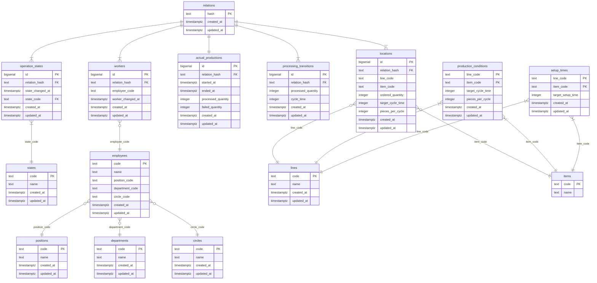

# データベース定義書

## 環境

<table>
    <tr>
        <th>RDBMS</th>
        <th>PostgreSQL</th>
    </tr>
    <tr>
        <th>バージョン</th>
        <th>14.2</th>
    </tr>
    <tr>
        <th>ホスト</th>
        <th>192.168.1.81</th>
    </tr>
    <tr>
        <th>ポート</th>
        <th>5432</th>
    </tr>
</table>

## データベース定義

<table>
    <tr>
        <th>データベース</th>
        <th>actual_production</th>
    </tr>
    <tr>
        <th>ユーザー</th>
        <th>actual_production</th>
    </tr>
    <tr>
        <th>パスワード</th>
        <th>yamato5863111</th>
    </tr>
    <tr>
        <th>文字コード</th>
        <th>UTF-8</th>
    </tr>
</table>


## ユーザー定義

### ユーザー一覧

| ユーザー名        | パスワード           | スーパーユーザー | データベースの作成 | ログイン可 | 利用範囲 | 備考                         |
| ----------------- | -------------------- | ---------------- | ------------------ | ---------- | -------- | ---------------------------- |
| postgres          | \*\*\*\*\*\*\*\*\*\* | ✓                | ✓                  | ✓          | 共用     | PostgreSQL の Admin ユーザー |
| actual_production | yamato5863111        |                  |                    | ✓          | 専用     | 本アプリケーション用ユーザー |
| ro_user           | 3111                 |                  |                    | ✓          | 共用     | 読み取り専用                 |

## スキーマ定義

開発時と本番時とでスキーマを区別する

スキーマ内のテーブルには、同じ仕様のテーブルを作成する

### スキーマ一覧

| 物理スキーマ名 | 論理スキーマ名 | 備考                     |
| -------------- | -------------- | ------------------------ |
| dev            | 開発環境       | 開発時に使用するスキーマ |
| prod           | 本番環境       | 実際に使用するスキーマ   |

## テーブル定義

### テーブル一覧

| 物理テーブル名         | 論理テーブル名 | 種別             | 説明                                   | 備考               |
| ---------------------- | -------------- | ---------------- | -------------------------------------- | ------------------ |
| relations              | リレーション   | トランザクション | 各テーブルを関連付ける共通ID           |                    |
| workers                | 作業者         | トランザクション | 作業者                                 |                    |
| locations              | ロケーション   | トランザクション | ライン、品番、指示数などの生産時の情報 |                    |
| actual_productions     | 実績           | トランザクション | 生産の結果                             |                    |
| processing_transitions | 加工推移       | トランザクション | 1サイクル毎の生産                      |                    |
| operation_states       | 生産状態推移   | トランザクション | 生産状態の推移                         |                    |
| states                 | 生産状態       | マスタ           | 生産状態                               |                    |
| production_conditions  | 生産条件       | マスタ           | ラインと品番毎の生産条件               |                    |
| setup_times            | 段取り時間     | マスタ           | ラインと品番毎の段取り時間             |                    |
| employees              | 社員           | 外部             | 社員マスタ                             | 共通DB（参照専用） |
| departments            | 部署           | 外部             | 部署マスタ                             | 共通DB（参照専用） |
| positions              | 役職           | 外部             | 役職マスタ                             | 共通DB（参照専用） |
| circles                | サークル       | 外部             | サークルマスタ                         | 共通DB（参照専用） |
| lines                  | ライン         | 外部             | ラインマスタ                           | 共通DB（参照専用） |
| items                  | 品目           | 外部             | 品目マスタ                             | 共通DB（参照専用） |

## 外部テーブル接続定義

外部テーブル参照には PostgreSQL FDW（Foreign Data Wrapper）を使用する。

### ラッパー

```sql
CREATE FOREIGN DATA WRAPPER postgres_fdw
    HANDLER postgres_fdw_handler
    VALIDATOR postgres_fdw_validator;
```

### サーバー一覧

| サーバー名 | 用途             |
| ---------- | ---------------- |
| share      | 共通マスタ参照用 |

※ 接続先ホスト、ポート、データベース名はサーバー定義側で管理する。

### User Mapping

#### postgres

```sql
CREATE USER MAPPING
FOR postgres
SERVER share
OPTIONS (
    user 'postgres',
    password '********'
);
```

#### actual_production

```sql
CREATE USER MAPPING
FOR actual_production
SERVER share
OPTIONS (
    user 'actual_production',
    password 'yamato5863111'
);
```

#### ro_user

```sql
CREATE USER MAPPING
FOR ro_user
SERVER share
OPTIONS (
    user 'ro_user',
    password '3111'
);

```

### 権限

**外部テーブル利用方針**

本システムで利用する外部テーブルは、Shareデータベースで管理される共通マスタを参照するために使用する  
外部テーブルに対するデータの登録、更新、削除は本システムから実施しない

```sql
GRANT SELECT ON TABLE dev.employees   TO actual_production;
GRANT SELECT ON TABLE dev.departments TO actual_production;
GRANT SELECT ON TABLE dev.positions   TO actual_production;
GRANT SELECT ON TABLE dev.circles     TO actual_production;
GRANT SELECT ON TABLE dev.lines       TO actual_production;
GRANT SELECT ON TABLE dev.items       TO actual_production;

GRANT SELECT ON TABLE prod.employees   TO actual_production;
GRANT SELECT ON TABLE prod.departments TO actual_production;
GRANT SELECT ON TABLE prod.positions   TO actual_production;
GRANT SELECT ON TABLE prod.circles     TO actual_production;
GRANT SELECT ON TABLE prod.lines       TO actual_production;
GRANT SELECT ON TABLE prod.items       TO actual_production;
```

## テーブル詳細

### テーブル

#### relations

| 物理カラム名 | 論理カラム名 | 型          | 主キー | ユニークキー | 外部キー | Not NULL | 備考 |
| ------------ | ------------ | ----------- | ------ | ------------ | -------- | -------- | ---- |
| hash         | ハッシュ値   | text        | ✓      |              |          | ✓        |      |
| created_at   | 作成日時     | timestamptz |        |              |          | ✓        |      |
| updated_at   | 更新日時     | timestamptz |        |              |          | ✓        |      |

#### workers

| 物理カラム名      | 論理カラム名 | 型          | 主キー | ユニークキー | 外部キー | Not NULL | 備考     |
| ----------------- | ------------ | ----------- | ------ | ------------ | -------- | -------- | -------- |
| id                | ID           | bigserial   | ✓      |              |          | ✓        | 自動採番 |
| relation_hash     | ハッシュ値   | text        |        |              | ✓        | ✓        |          |
| employee_code     | 社員コード   | text        |        |              |          | ✓        |          |
| worker_changed_at | 変更日時     | timestamptz |        |              |          | ✓        |          |
| created_at        | 作成日時     | timestamptz |        |              |          | ✓        |          |
| updated_at        | 更新日時     | timestamptz |        |              |          | ✓        |          |

#### locations

| 物理カラム名      | 論理カラム名       | 型          | 主キー | ユニークキー | 外部キー | Not NULL | 備考     |
| ----------------- | ------------------ | ----------- | ------ | ------------ | -------- | -------- | -------- |
| id                | ID                 | bigserial   | ✓      |              |          | ✓        | 自動採番 |
| relation_hash     | ハッシュ値         | text        |        |              | ✓        | ✓        |          |
| line_code         | 職場コード         | text        |        |              |          | ✓        |          |
| item_code         | 品目コード         | text        |        |              |          | ✓        |          |
| ordered_quantity  | 指示数             | integer     |        |              |          | ✓        |          |
| target_cycle_time | 目標サイクルタイム | integer     |        |              |          | ✓        |          |
| pieces_per_cycle  | 取り数             | integer     |        |              |          | ✓        |          |
| created_at        | 作成日時           | timestamptz |        |              |          | ✓        |          |
| updated_at        | 更新日時           | timestamptz |        |              |          | ✓        |          |

#### actual_productions

| 物理カラム名       | 論理カラム名 | 型          | 主キー | ユニークキー | 外部キー | Not NULL | 備考     |
| ------------------ | ------------ | ----------- | ------ | ------------ | -------- | -------- | -------- |
| id                 | ID           | bigserial   | ✓      |              |          | ✓        | 自動採番 |
| relation_hash      | ハッシュ値   | text        |        |              | ✓        | ✓        |          |
| started_at         | 開始日時     | timestamptz |        |              |          |          |          |
| ended_at           | 終了日時     | timestamptz |        |              |          |          |          |
| processed_quantity | 加工数       | integer     |        |              |          |          |          |
| failed_quantity    | 不良数       | integer     |        |              |          |          |          |
| created_at         | 作成日時     | timestamptz |        |              |          | ✓        |          |
| updated_at         | 更新日時     | timestamptz |        |              |          | ✓        |          |

#### processing_transitions

| 物理カラム名       | 論理カラム名   | 型          | 主キー | ユニークキー | 外部キー | Not NULL | 備考     |
| ------------------ | -------------- | ----------- | ------ | ------------ | -------- | -------- | -------- |
| id                 | ID             | bigserial   | ✓      |              |          | ✓        | 自動採番 |
| relation_hash      | ハッシュ値     | text        |        |              | ✓        | ✓        |          |
| processed_quantity | 加工数         | integer     |        |              |          | ✓        |          |
| cycle_time         | サイクルタイム | integer     |        |              |          | ✓        |          |
| created_at         | 作成日時       | timestamptz |        |              |          | ✓        |          |
| updated_at         | 更新日時       | timestamptz |        |              |          | ✓        |          |

#### operation_states

| 物理カラム名     | 論理カラム名     | 型          | 主キー | ユニークキー | 外部キー | Not NULL | 備考     |
| ---------------- | ---------------- | ----------- | ------ | ------------ | -------- | -------- | -------- |
| id               | ID               | bigserial   | ✓      |              |          | ✓        | 自動採番 |
| relation_hash    | ハッシュ値       | text        |        |              | ✓        | ✓        |          |
| state_changed_at | 生産状態更新日時 | timestamptz |        |              |          | ✓        |          |
| state_code       | 生産状態コード   | text        |        |              | ✓        | ✓        |          |
| created_at       | 作成日時         | timestamptz |        |              |          | ✓        |          |
| updated_at       | 更新日時         | timestamptz |        |              |          | ✓        |          |

#### states

| 物理カラム名 | 論理カラム名   | 型          | 主キー | ユニークキー | 外部キー | Not NULL | 備考 |
| ------------ | -------------- | ----------- | ------ | ------------ | -------- | -------- | ---- |
| code         | 生産状態コード | text        | ✓      |              |          | ✓        |      |
| name         | 生産状態名     | text        |        |              |          | ✓        |      |
| created_at   | 作成日時       | timestamptz |        |              |          | ✓        |      |
| updated_at   | 更新日時       | timestamptz |        |              |          | ✓        |      |

#### production_conditions

| 物理カラム名      | 論理カラム名       | 型          | 主キー | ユニークキー | 外部キー | Not NULL | 備考       |
| ----------------- | ------------------ | ----------- | ------ | ------------ | -------- | -------- | ---------- |
| line_code         | 職場コード         | text        | ✓      |              |          | ✓        | 複合主キー |
| item_code         | 品目コード         | text        | ✓      |              |          | ✓        | 複合主キー |
| target_cycle_time | 目標サイクルタイム | integer     |        |              |          | ✓        |            |
| pieces_per_cycle  | 取り数             | integer     |        |              |          | ✓        |            |
| created_at        | 作成日時           | timestamptz |        |              |          | ✓        |            |
| updated_at        | 更新日時           | timestamptz |        |              |          | ✓        |            |

#### setup_times

| 物理カラム名      | 論理カラム名   | 型          | 主キー | ユニークキー | 外部キー | Not NULL | 備考       |
| ----------------- | -------------- | ----------- | ------ | ------------ | -------- | -------- | ---------- |
| line_code         | 職場コード     | text        | ✓      |              |          | ✓        | 複合主キー |
| item_code         | 品目コード     | text        | ✓      |              |          | ✓        | 複合主キー |
| target_setup_time | 目標段取り時間 | integer     |        |              |          | ✓        |            |
| created_at        | 作成日時       | timestamptz |        |              |          | ✓        |            |
| updated_at        | 更新日時       | timestamptz |        |              |          | ✓        |            |

### 外部テーブル

#### employees

| 物理カラム名    | 論理カラム名   | 型          | 主キー | Not NULL |
| --------------- | -------------- | ----------- | ------ | -------- |
| code            | 社員コード     | text        | ✓      | ✓        |
| name            | 社員名         | text        |        | ✓        |
| position_code   | 役職コード     | text        |        | ✓        |
| department_code | 部署コード     | text        |        |          |
| circle_code     | サークルコード | text        |        |          |
| created_at      | 作成日時       | timestamptz |        | ✓        |
| updated_at      | 更新日時       | timestamptz |        | ✓        |

#### departments

| 物理カラム名 | 論理カラム名 | 型          | 主キー | Not NULL |
| ------------ | ------------ | ----------- | ------ | -------- |
| code         | 部署コード   | text        | ✓      | ✓        |
| name         | 部署名       | text        |        | ✓        |
| created_at   | 作成日時     | timestamptz |        | ✓        |
| updated_at   | 更新日時     | timestamptz |        | ✓        |

#### positions

| 物理カラム名 | 論理カラム名 | 型          | 主キー | Not NULL |
| ------------ | ------------ | ----------- | ------ | -------- |
| code         | 役職コード   | text        | ✓      | ✓        |
| name         | 役職名       | text        |        | ✓        |
| created_at   | 作成日時     | timestamptz |        | ✓        |
| updated_at   | 更新日時     | timestamptz |        | ✓        |

#### circles

| 物理カラム名 | 論理カラム名   | 型          | 主キー | Not NULL |
| ------------ | -------------- | ----------- | ------ | -------- |
| code         | サークルコード | text        | ✓      | ✓        |
| name         | サークル名     | text        |        | ✓        |
| created_at   | 作成日時       | timestamptz |        | ✓        |
| updated_at   | 更新日時       | timestamptz |        | ✓        |

#### lines

| 物理カラム名 | 論理カラム名 | 型          | 主キー | Not NULL |
| ------------ | ------------ | ----------- | ------ | -------- |
| code         | ラインコード | text        | ✓      | ✓        |
| name         | ライン名     | text        |        | ✓        |
| created_at   | 作成日時     | timestamptz |        | ✓        |
| updated_at   | 更新日時     | timestamptz |        | ✓        |

#### items

| 物理カラム名 | 論理カラム名 | 型   | 主キー | Not NULL |
| ------------ | ------------ | ---- | ------ | -------- |
| code         | 品目コード   | text | ✓      | ✓        |
| name         | 品目番号/名称       | text |        | ✓        |

## ER図



## DDL

### データベース

#### actual_production

```sql
CREATE ROLE
	actual_production
WITH 
	NOSUPERUSER
	NOCREATEDB
	NOCREATEROLE
	NOINHERIT
	LOGIN
	NOREPLICATION
	NOBYPASSRLS
	CONNECTION LIMIT -1;
```

### スキーマ

**dev**

```sql
GRANT USAGE ON SCHEMA dev TO actual_production;
```

```sql
GRANT ALL PRIVILEGES ON ALL TABLES IN SCHEMA dev TO actual_production;
```

**prod**

```sql
GRANT USAGE ON SCHEMA prod TO actual_production;
```

```sql
GRANT ALL PRIVILEGES ON ALL TABLES IN SCHEMA prod TO actual_production;
```

```sql
GRANT USAGE ON SCHEMA prod TO ro_user;
```

```sql
GRANT SELECT ON ALL TABLES IN SCHEMA prod TO ro_user;
```

### テーブル

#### relations

**dev**

```sql
CREATE TABLE dev.relations (
	hash text NOT NULL,
	created_at timestamptz NOT NULL,
	updated_at timestamptz NOT NULL,
	CONSTRAINT pk_relations_01 PRIMARY KEY (hash)
);
```

**prod**

```sql
CREATE TABLE prod.relations (
	hash text NOT NULL,
	created_at timestamptz NOT NULL,
	updated_at timestamptz NOT NULL,
	CONSTRAINT pk_relations_01 PRIMARY KEY (hash)
);
```

#### workers

**dev**

```sql
CREATE TABLE dev.workers (
	id bigserial NOT NULL,
	relation_hash text NOT NULL,
	employee_code text NOT NULL,
	worker_changed_at timestamptz NOT NULL,
	created_at timestamptz NOT NULL,
	updated_at timestamptz NOT NULL,
	CONSTRAINT pk_workers_01 PRIMARY KEY (id),
	CONSTRAINT fk_workers_01 FOREIGN KEY (relation_hash) REFERENCES dev.relations(hash) ON DELETE CASCADE ON UPDATE CASCADE
);
```

**prod**

```sql
CREATE TABLE prod.workers (
	id bigserial NOT NULL,
	relation_hash text NOT NULL,
	employee_code text NOT NULL,
	worker_changed_at timestamptz NOT NULL,
	created_at timestamptz NOT NULL,
	updated_at timestamptz NOT NULL,
	CONSTRAINT pk_workers_01 PRIMARY KEY (id),
	CONSTRAINT fk_workers_01 FOREIGN KEY (relation_hash) REFERENCES prod.relations(hash) ON DELETE CASCADE ON UPDATE CASCADE
);
```

#### locations

**dev**

```sql
CREATE TABLE dev.locations (
	id bigserial NOT NULL,
	relation_hash text NOT NULL,
	line_code text NOT NULL,
	item_code text NOT NULL,
	ordered_quantity int4 NOT NULL,
	target_cycle_time int4 NOT NULL,
	pieces_per_cycle int4 NOT NULL,
	created_at timestamptz NOT NULL,
	updated_at timestamptz NOT NULL,
	CONSTRAINT pk_locations_01 PRIMARY KEY (id),
	CONSTRAINT fk_locations_01 FOREIGN KEY (relation_hash) REFERENCES dev.relations(hash) ON DELETE CASCADE ON UPDATE CASCADE
);
CREATE INDEX idx_locations_01 ON dev.locations USING btree (relation_hash);
```

**prod**

```sql
CREATE TABLE prod.locations (
	id bigserial NOT NULL,
	relation_hash text NOT NULL,
	line_code text NOT NULL,
	item_code text NOT NULL,
	ordered_quantity int4 NOT NULL,
	target_cycle_time int4 NOT NULL,
	pieces_per_cycle int4 NOT NULL,
	created_at timestamptz NOT NULL,
	updated_at timestamptz NOT NULL,
	CONSTRAINT pk_locations_01 PRIMARY KEY (id),
	CONSTRAINT fk_locations_01 FOREIGN KEY (relation_hash) REFERENCES prod.relations(hash) ON DELETE CASCADE ON UPDATE CASCADE
);
CREATE INDEX idx_locations_01 ON prod.locations USING btree (relation_hash);
```

#### actual_productions

**dev**

```sql
CREATE TABLE dev.actual_productions (
	id bigserial NOT NULL,
	relation_hash text NOT NULL,
	started_at timestamptz NOT NULL,
	ended_at timestamptz NOT NULL,
	processed_quantity int4 NOT NULL,
	failed_quantity int4 NOT NULL,
	created_at timestamptz NOT NULL,
	updated_at timestamptz NOT NULL,
	CONSTRAINT pk_actual_productions_01 PRIMARY KEY (id),
	CONSTRAINT fk_actual_productions_01 FOREIGN KEY (relation_hash) REFERENCES dev.relations(hash) ON DELETE CASCADE ON UPDATE CASCADE
);
CREATE INDEX idx_actual_productions_01 ON dev.actual_productions USING btree (relation_hash);
```

**prod**

```sql
CREATE TABLE prod.actual_productions (
	id bigserial NOT NULL,
	relation_hash text NOT NULL,
	started_at timestamptz NOT NULL,
	ended_at timestamptz NOT NULL,
	processed_quantity int4 NOT NULL,
	failed_quantity int4 NOT NULL,
	created_at timestamptz NOT NULL,
	updated_at timestamptz NOT NULL,
	CONSTRAINT pk_actual_productions_01 PRIMARY KEY (id),
	CONSTRAINT fk_actual_productions_01 FOREIGN KEY (relation_hash) REFERENCES prod.relations(hash) ON DELETE CASCADE ON UPDATE CASCADE
);
CREATE INDEX idx_actual_productions_01 ON prod.actual_productions USING btree (relation_hash);
```

#### processing_transitions

**dev**

```sql
CREATE TABLE dev.processing_transitions (
	id bigserial NOT NULL,
	relation_hash text NOT NULL,
	processed_quantity int4 NOT NULL,
	cycle_time int4 NOT NULL,
	created_at timestamptz NOT NULL,
	updated_at timestamptz NOT NULL,
	CONSTRAINT pk_processing_transition_01 PRIMARY KEY (id),
	CONSTRAINT fk_processing_transitions_01 FOREIGN KEY (relation_hash) REFERENCES dev.relations(hash) ON DELETE CASCADE ON UPDATE CASCADE
);
CREATE INDEX idx_processing_transitions_01 ON dev.processing_transitions USING btree (relation_hash);
```

**prod**

```sql
CREATE TABLE prod.processing_transitions (
	id bigserial NOT NULL,
	relation_hash text NOT NULL,
	processed_quantity int4 NOT NULL,
	cycle_time int4 NOT NULL,
	created_at timestamptz NOT NULL,
	updated_at timestamptz NOT NULL,
	CONSTRAINT pk_processing_transition_01 PRIMARY KEY (id),
	CONSTRAINT fk_processing_transitions_01 FOREIGN KEY (relation_hash) REFERENCES prod.relations(hash) ON DELETE CASCADE ON UPDATE CASCADE
);
CREATE INDEX idx_processing_transitions_01 ON prod.processing_transitions USING btree (relation_hash);
```

#### operation_states

**dev**

```sql
CREATE TABLE dev.operation_states (
	id bigserial NOT NULL,
	relation_hash text NOT NULL,
	state_changed_at timestamptz NOT NULL,
	state_code text NOT NULL,
	created_at timestamptz NOT NULL,
	updated_at timestamptz NOT NULL,
	CONSTRAINT pk_operation_states_01 PRIMARY KEY (id),
	CONSTRAINT fk_operation_states_01 FOREIGN KEY (relation_hash) REFERENCES dev.relations(hash) ON DELETE CASCADE ON UPDATE CASCADE,
	CONSTRAINT fk_operation_states_02 FOREIGN KEY (state_code) REFERENCES dev.states(code) ON UPDATE CASCADE
);
CREATE INDEX idx_operation_states_01 ON dev.operation_states USING btree (relation_hash);
```

**prod**

```sql
CREATE TABLE prod.operation_states (
	id bigserial NOT NULL,
	relation_hash text NOT NULL,
	state_changed_at timestamptz NOT NULL,
	state_code text NOT NULL,
	created_at timestamptz NOT NULL,
	updated_at timestamptz NOT NULL,
	CONSTRAINT pk_operation_states_01 PRIMARY KEY (id),
	CONSTRAINT fk_operation_states_01 FOREIGN KEY (relation_hash) REFERENCES prod.relations(hash) ON DELETE CASCADE ON UPDATE CASCADE,
	CONSTRAINT fk_operation_states_02 FOREIGN KEY (state_code) REFERENCES prod.states(code) ON UPDATE CASCADE
);
CREATE INDEX idx_operation_states_01 ON prod.operation_states USING btree (relation_hash);
```

#### states

**dev**

```sql
CREATE TABLE dev.states (
	code text NOT NULL,
	"name" text NOT NULL,
	created_at timestamptz NOT NULL,
	updated_at timestamptz NOT NULL,
	CONSTRAINT pk_state_01 PRIMARY KEY (code)
);
```

**prod**

```sql
CREATE TABLE prod.states (
	code text NOT NULL,
	"name" text NOT NULL,
	created_at timestamptz NOT NULL,
	updated_at timestamptz NOT NULL,
	CONSTRAINT pk_state_01 PRIMARY KEY (code)
);
```

#### production_conditions

**dev**

```sql
CREATE TABLE dev.production_conditions (
    line_code text NOT NULL,
    item_code text NOT NULL,
    target_cycle_time int4 NOT NULL,
    pieces_per_cycle int4 NOT NULL,
    created_at timestamptz NOT NULL,
    updated_at timestamptz NOT NULL,
    CONSTRAINT pk_production_conditions_01 PRIMARY KEY (line_code, item_code)
);
```

**prod**

```sql
CREATE TABLE prod.production_conditions (
    line_code text NOT NULL,
    item_code text NOT NULL,
    target_cycle_time int4 NOT NULL,
    pieces_per_cycle int4 NOT NULL,
    created_at timestamptz NOT NULL,
    updated_at timestamptz NOT NULL,
    CONSTRAINT pk_production_conditions_01 PRIMARY KEY (line_code, item_code)
);
```

#### setup_times

**dev**

```sql
CREATE TABLE dev.setup_times (
    line_code text NOT NULL,
    item_code text NOT NULL,
    target_setup_time int4 NOT NULL,
    created_at timestamptz NOT NULL,
    updated_at timestamptz NOT NULL,
    CONSTRAINT pk_setup_times_01 PRIMARY KEY ( line_code, item_code)
);
```

**prod**

```sql
CREATE TABLE prod.setup_times (
    line_code text NOT NULL,
    item_code text NOT NULL,
    target_setup_time int4 NOT NULL,
    created_at timestamptz NOT NULL,
    updated_at timestamptz NOT NULL,
    CONSTRAINT pk_setup_times_01 PRIMARY KEY (line_code, item_code)
);
```

## 巻末

| 作成日 改訂日 | 内容                                |
| ------------- | ----------------------------------- |
| 2024/02/20    | 本資料作成                          |
| 2026/07/24    | DDLの不備を修正                     |
| 2026/07/24    | setup_timesテーブルを追加           |
| 2026/07/24    | production_conditionsテーブルを追加 |
